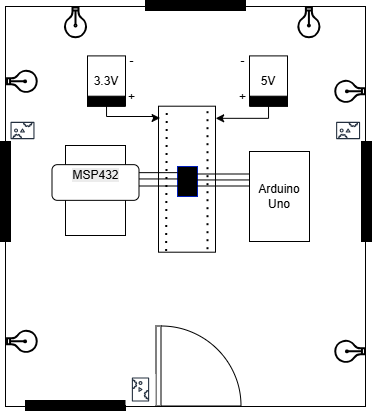
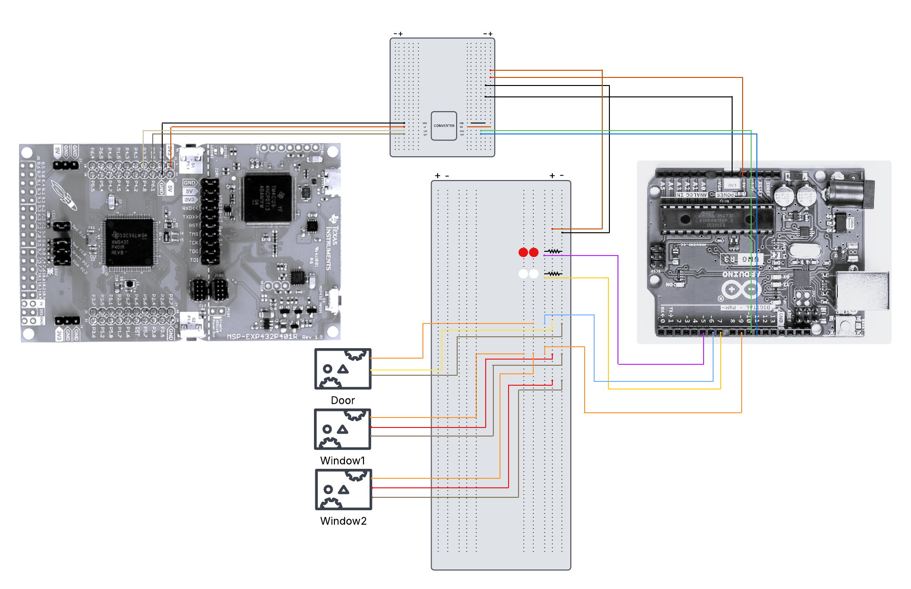

# SmartHome
Repository for the Embedded Software for the IoT project at the University of Trento.

# Members
- [Ismaele Landini](https://github.com/Ismaele-landini)
- [Sophie Motter](https://github.com/sophiee03)
- [Tommaso Michelotti](https://github.com/Tommo-Tom)
- [Norris Kervatin](https://github.com/kerva17)

# Description and Functionality
Our project consist in creating a Smart Home that can provide many functionality exploiting the sensors of microcontrollers, including turning on the lights if someone enters the house and turn them off if someone exits, continuously check the temperature inside the abitation to open/close the windows in case of high/low temperature, checking constantly updated environment parameters on the display and alert people inside the house if an earthquake occurs by opening the door, switching on an alarm light and buzzer and by signaling the situation on the display. 
In addition we have introduced an edit mode that allows for testing, the user can choose on the display among these options:
- turn on lights
- turn off lights
- open windows
- close windows
- enter (open door and turn on lights)
- exit (open door and turn off lights)

***NB:*** To have a schematic view of the functionalities check out the [Flowchart Diagram](https://github.com/sophiee03/SmartHome/blob/main/files/Flowchart_SmartHome.pdf)

# Hardware Components
The equipment we used is:
- [MSP432 Launchpad](https://www.ti.com/)
- MSP432 Boosterpack Sensors
- Arduino Uno
- Microservi SG90
- Led and diode
- Breadboard
- Resistors (220 Ohm)
- Converter

# Home Arrangement


# Software Environment
- Arduino Uno
- Energia.nu

# Project Layout
```plaintext
├── README.md
├── files                         # contains useful files
│   ├── EMBEDDED.pdf              # presentation for the exam
│   ├── Smart_Home_diagram.png    # diagram of the connections
│   ├── Flowchart_SmartHome.pdf   # diagram to see the flow of the project
|   └── SmartHome.drawio.png      # image showing the project
└── code
    ├── msp_code.ino              # code for the MSP432 with Energia.nu
    └── arduino_code.ino          # code for aurduino with Arduino Uno 
```
# Steps to Run (Hardware side)
The connections that we have made to implement this project are the following:


# Steps to Run (Software side)
In order to test this project the first thing to do is having these developing environment installed and setup: [Arduino Uno](https://www.arduino.cc/en/software/) and [Energia.nu](https://energia.nu/download/). In addition, in the energia environment it is required to download Energia MSP432 EMT RED boards in order to execute our code. 
Then the files in the [code](https://github.com/sophiee03/SmartHome/tree/main/code) folder can be dowloaded and opened in their editor.
Finally after setting up the hardware part, it is only necessary to compile and run on your PC.

***NB:*** Be careful to select (in the arduino environment) Arduino Uno and the correct ports (COM)

# [Presentation](https://www.canva.com/design/DAGsqeLUTmU/nd26wiBK8WcuRsx4vUayQw/edit?utm_content=DAGsqeLUTmU&utm_campaign=designshare&utm_medium=link2&utm_source=sharebutton)

# [YouTube Video](https://youtu.be/dTfHrDASOO8)

# Contribution 
The project workflow was equally divided among all team members. Each member contributed to the following tasks:
- Gathering hardware components: resistors, LEDs, diodes, Arduino UNO, MSP432 LaunchPad, servos, level converters (3.3V to 5V), jumper wires, and breadboards.
- Constructing the physical structure of the smart house.
- Developing the software using Energia (for MSP432) and the Arduino IDE.
- Managing the wiring and cabling between components.
